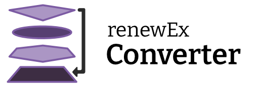

# RenewEx Converter



[Renew](http://renew.de/) file converter to turn files parsed with [RenewEx](https://hexdocs.pm/renewex/) ([Repository](https://github.com/laszlokorte/renewex/)) into a canonical structure that can be worked with more easily (for example be imported into a database). 

[](https://hex.pm/packages/renewex_converter) [](https://hexdocs.pm/renewex_converter/)

---

## Test cases

The conveter is tested [on more than 1000 example files.](https://github.com/laszlokorte/renewex_converter/tree/main/test/fixtures/valid_files)

### Running tests

All test:
```sh
mix test
```

Only fast tests:
```sh
mix test --exclude slow
```

## Example Usage

```example.ex
# Read rnw file
{:ok, file_content} = File.read("example.rnw")

# Parse file content
{:ok, %Renewex.Document{} = document} = Renewex.parse_document(file_content)
{:ok, %LayeredDocument{
	version: version, 
	# ^ 11
	kind: kind, 
	# ^ de.renew.gui.CPNDrawing
	layers: layers, 
	# ^ [%RenewexConverter.Layer{
	#	id: _,
	#	content: _,
	#	tag: "de.renew.gui.PlaceFigure",
	#	z_index: 0,
	#	hidden: false} |_ ]
	hierarchy: hierarchy, 
	# ^ [%LayeredDocument.Nesting{
	#	ancestor_id: _,
	#	descendant_id: _,
	#	depth: 0} | _]
	hyperlinks: hyperlinks,
	# ^ [%LayeredDocument.Hyperlink{
	#	source_id: _,
	#	target_id: 0} | _]
}} = RenewexConverter.consume_document(doc)
```

---

[www.laszlokorte.de](//www.laszlokorte.de)